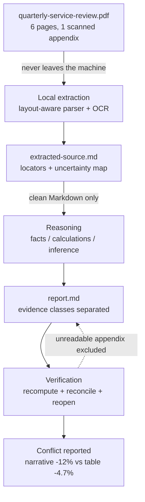

# A worked example

This is one complete pass through the pipeline, using invented data. Nothing
here came from a real document.

Read the two files in order:

1. **[extracted-source.md](extracted-source.md)** — what the ingest stage hands
   to the model. Compact Markdown, a page locator on every fact, and an explicit
   list of what the parser could not read or could not agree on.
2. **[report.md](report.md)** — what comes back. Sourced facts, calculations,
   inferences, recommendations, and unknowns are kept visibly separate.

The diagram source is [pipeline.mmd](pipeline.mmd) — a few lines of text that a
local engine renders. The model never draws pixels.

## What this example is meant to show

**The summary in the source document is wrong, and the process catches it.**

Page 2 of the synthetic source claims incidents "fell by roughly 12%". The table
on page 3 says 107 to 102, which is `-4.7%`. A model that summarises the prose
repeats the 12%. A model that recomputes the table and reconciles the two finds
the contradiction.

The report does three things that matter more than the number:

- It **reports both figures and picks the reproducible one**, rather than
  averaging them or quietly choosing the more flattering one.
- It **excludes the unreadable appendix from every claim** instead of guessing
  at it, and says so.
- It **separates the inference from the fact**. "West rose 50%" is sourced.
  "West's rise may be small-denominator volatility" is labelled inference,
  because the document does not say it.

## What it is not

This is a demonstration of the output contract, not a benchmark. It does not
show extraction accuracy on real documents, and it is not evidence that any
particular parser will read your files correctly. Run the fixtures on your own
machine and your own documents for that.
